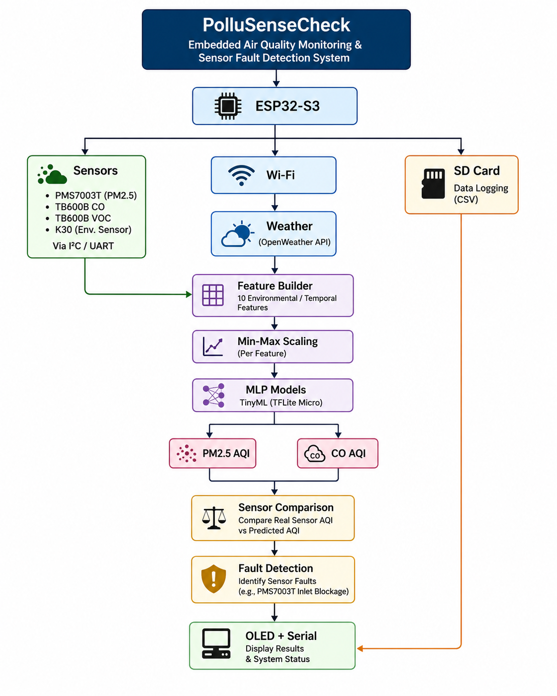

# PolluSenseCheck

## Embedded TinyML-Based Air Quality Monitoring and Sensor Fault Detection

PolluSenseCheck is an ESP32-S3-based embedded air-quality monitoring system that combines real sensor measurements with **secondary sensing through machine learning** to assess sensor health.

The system continuously collects environmental and pollutant information, constructs a 10-feature input vector, applies the same Min-Max scaling used during desktop model training, performs on-device AQI classification using lightweight MLP models, and compares the predicted AQI with the AQI obtained from the physical pollutant sensors.

A deviation between the sensor-derived and model-predicted AQI contributes to the sensor fault score. The system can therefore identify a sensor as **FAULTY** and later return it to **HEALTHY** when normal operation resumes.

> **Important:** This repository documents the actual implementation developed for this project. It does **not** reproduce the 53-feature, SMOTE, and PCA pipeline described in the original PolluSenseCheck paper.

---

## Overview

Low-cost air-quality sensors are useful for affordable monitoring but can experience abnormal behavior and measurement drift. PolluSenseCheck explores a self-checking approach in which the pollutant sensor is not the only source of information used to assess its health.

The system uses:

* Real pollutant sensor measurements
* Environmental measurements
* Weather information
* Time-based features
* Machine-learning-based secondary sensing
* On-device AQI classification
* Sensor comparison
* A continuously updated fault score
* OLED and serial status reporting
* SD-card data logging

The final embedded system runs on an **ESP32-S3** using the **ESP-IDF** framework.

---

## System Architecture



The overall embedded pipeline is:

```text
                         PolluSenseCheck
                               |
                           ESP32-S3
                               |
        +----------------------+----------------------+
        |                      |                      |
     Sensors                  Wi-Fi                SD Card
        |                      |                      |
        |                    Weather                  |
        +----------------------+                      |
                               |                      |
                       Feature Builder                |
                               |                      |
                        Min-Max Scaling               |
                               |                      |
                           MLP Models                 |
                         +-----------+                |
                         |           |                |
                      PM2.5 AQI    CO AQI             |
                         |           |                |
                         +-----+-----+                |
                               |                      |
                       Sensor Comparison             |
                               |                      |
                        Fault Detection               |
                               |                      |
                         OLED + Serial ---------------+
```

The firmware orchestrates the complete sensing, inference, comparison, display, and logging cycle.

---

## Hardware

The embedded system is built around an ESP32-S3 and integrates pollutant, environmental, communication, display, and storage components.

### Main Controller

* ESP32-S3
* ESP-IDF firmware
* Wi-Fi connectivity
* On-device TinyML inference

### Sensors and Peripherals

The project integrates the sensor and peripheral modules used by the firmware, including:

* PMS7003T particulate-matter sensor
* TB600B CO sensor
* TB600B VOC sensor
* Environmental sensing
* OLED display
* SD card storage

The firmware contains dedicated modules for sensor acquisition, communication, feature construction, machine-learning inference, AQI calculation, and fault detection.

Hardware photographs are available in:

```text
docs/hardware/
```

---

## Software Stack

### Embedded

* C / C++
* ESP-IDF
* FreeRTOS
* ESP32-S3
* I²C
* UART
* SPI
* TensorFlow Lite Micro

### Machine Learning

* Python
* TensorFlow / Keras
* NumPy
* Pandas
* Scikit-learn
* Min-Max scaling
* Multilayer Perceptron (MLP)

### Development

* VS Code
* ESP-IDF
* Git
* GitHub

---

# Machine Learning Pipeline

## Input Features

The desktop training dataset uses **10 input features**.

### Atmospheric features

1. Temperature (AT)
2. Relative Humidity (RH)
3. Wind Speed (WS)
4. Wind Direction (WD)
5. Total Rainfall (TOT-RF)
6. Barometric Pressure (BP)

### Temporal features

7. Month
8. Weekday
9. Hour
10. Season

The temporal information is derived from time information available to the system.

### Season Encoding

The implemented season encoding is:

```text
Season 0 → December, January, February
Season 1 → March, April, May
Season 2 → June, July, August
Season 3 → September, October, November
```

---

## Targets

Two AQI classification models are trained independently:

```text
Input Features
      |
      +------------------+
      |                  |
      v                  v
AQI_PM_2_5            AQI_CO
      |                  |
      v                  v
PM2.5 AQI Model       CO AQI Model
```

The raw dataset also contains the pollutant measurements used to obtain the corresponding AQI targets.

---

## Preprocessing

The implemented desktop pipeline uses:

```text
Raw Dataset
     |
10 Input Features
     |
Min-Max Scaling
     |
Train / Validation / Test
     |
MLP Classification
```

### Important implementation detail

The current implementation uses:

* **Min-Max scaling**
* **No PCA**
* **No SMOTE**

This differs from the methodology described in the original PolluSenseCheck paper. The repository intentionally documents the implementation actually developed for this project.

---

# MLP Model

Two separate MLP classifiers are trained:

### PM2.5 AQI Model

```text
Input Layer
10 features
     |
128 neurons
ReLU
     |
128 neurons
ReLU
     |
128 neurons
ReLU
     |
5-class output
Softmax
```

### CO AQI Model

```text
Input Layer
10 features
     |
128 neurons
ReLU
     |
128 neurons
ReLU
     |
128 neurons
ReLU
     |
3-class output
Softmax
```

The models use:

* Adam optimizer
* Learning rate: `0.001`
* Sparse categorical cross-entropy
* Batch size: `32`
* Maximum epochs: `300`
* Early stopping
* Learning-rate reduction on plateau

The training workflow and evaluation code are provided in:

```text
ml/training/durgapur_aqi_mlp_training.ipynb
```

---

# Dataset

The raw dataset is stored in:

```text
data/raw/durgapur_aqi_4seasons.csv
```

The dataset contains:

* Environmental/atmospheric variables
* Temporal variables
* PM2.5 AQI target
* CO AQI target

The dataset is used directly for the training workflow; no separate processed or sample dataset is required by the repository.

---

# Model Conversion and Deployment

After desktop training, the trained Keras models are converted to TensorFlow Lite format for embedded deployment.

```text
Keras Model
    |
    v
Float32 TensorFlow Lite Model
    |
    v
ESP32-S3 / TensorFlow Lite Micro
```

The repository contains the model artifacts under:

```text
ml/models/
```

and the scaling information required for deployment under:

```text
ml/preprocessing/
```

The exported model files allow the trained models to be used by the embedded ESP32-S3 firmware.

---

# Embedded Firmware

The complete ESP-IDF application is located under:

```text
firmware/esp-idf/
```

The firmware is organized into separate components for sensor communication, data processing, machine learning, display, storage, connectivity, AQI calculation, and fault detection.

Important modules include:

```text
components/
├── i2c_bus/
├── config/
├── k30/
├── pm_sensor/
├── tb600b_co/
├── tb600b_voc/
├── sensor_manager/
├── sdcard/
├── oled/
├── wifi/
├── weather/
├── feature_builder/
├── ml_preprocessing/
├── tinyml/
├── ml_manager/
├── aqi/
└── interocept/
```

The application entry point is:

```text
firmware/esp-idf/main/main.c
```

---

# Embedded Runtime Pipeline

The main firmware continuously executes the following sequence:

```text
System Boot
    |
I²C Initialization
    |
OLED Initialization
    |
SD Card Initialization
    |
Sensor Manager Initialization
    |
Wi-Fi Initialization
    |
Weather Initialization
    |
ML Manager Initialization
    |
    v
Continuous Loop
    |
Weather Update / Cached Weather
    |
Sensor Acquisition
    |
AQI Calculation
    |
Feature Vector Construction
    |
TinyML Prediction
    |
Sensor vs. Prediction Comparison
    |
Fault Status Update
    |
OLED Update
    |
Serial Output
    |
SD Card Logging
    |
5-second cycle delay
    |
Repeat
```

The firmware therefore performs the complete inference and sensor-health workflow on the embedded device rather than depending on a desktop computer during normal operation.

---

# Secondary Sensing

The central idea of the system is to estimate the expected pollutant AQI using information that is independent of the pollutant sensor being checked.

The embedded system therefore has two values:

```text
Real Sensor AQI
      +
Secondary-Sensing Predicted AQI
      |
      v
Comparison
```

The prediction is generated using the environmental and temporal feature vector.

A persistent deviation between these two values contributes to the fault score.

---

# Sensor Fault Detection

The fault-detection mechanism maintains a fault score for the sensor.

Conceptually:

```text
Predicted AQI
      |
      |
      v
Compare with
Real Sensor AQI
      |
      v
AQI deviation
      |
      v
Fault Score Update
      |
      +--------------------+
      |                    |
Below threshold       Above threshold
      |                    |
   HEALTHY              FAULTY
```

The device reports the current sensor state as:

```text
HEALTHY
```

or:

```text
FAULTY
```

The fault score is not permanently latched to the faulty condition. When normal measurements resume, the score can decrease and the sensor can return to the healthy state.

---

# PMS7003T Fault-Injection Demonstration

A controlled experiment was performed to test the sensor fault-detection mechanism.

The inlet of the PMS7003T sensor was intentionally blocked using a piece of tape.

### Observed sequence

| Time             | Observation                                                                                       |
| ---------------- | ------------------------------------------------------------------------------------------------- |
| **00:35**        | After the PMS7003T inlet is blocked, the sensor output reaches **zero**.                          |
| **00:35 onward** | The **fault score starts increasing** as the system detects abnormal sensor behavior.             |
| **01:30**        | The fault score reaches the configured threshold and the system reports the sensor as **FAULTY**. |
| **02:10**        | The tape is removed from the PMS7003T inlet.                                                      |
| **02:22**        | The sensor resumes normal operation and the **fault score starts decreasing**.                    |
| **03:38**        | The fault score falls below the threshold and the sensor status changes back to **HEALTHY**.      |

### Experimental sequence

```text
Normal Operation
       |
       v
PMS7003T Inlet Blocked
       |
       v
PM Reading → 0
       |
       v
Fault Score Increases
       |
       v
Sensor → FAULTY
       |
       v
Tape Removed
       |
       v
Sensor Returns to Normal Operation
       |
       v
Fault Score Decreases
       |
       v
Sensor → HEALTHY
```

The demonstration video is available in:

```text
results/fault_detection/
```

---

# Device Output

The firmware reports the current sensor and model information through the serial interface.

For PM2.5, the device reports:

```text
PM2.5
  Real Value
  Real AQI
  Predicted Class
  Status
```

For CO, the device reports:

```text
CO
  Real Value
  Real AQI
  Predicted Class
  Status
```

The possible sensor status values are:

```text
HEALTHY
FAULTY
```

Device screenshots and outputs are available in:

```text
results/device/
```

---

# Model Training Results

The desktop training results are organized separately for the two target variables.

```text
results/training/
├── pm25/
└── co/
```

The result directories contain the generated training and evaluation outputs, including the relevant performance plots and classification results.

These results correspond to the models trained using the 10 environmental and temporal features with Min-Max scaling.

---

# Desktop-to-Device Workflow

The complete development workflow is:

```text
Raw Air-Quality Dataset
        |
        v
Feature Selection
        |
        v
10 Environmental / Temporal Features
        |
        v
Min-Max Scaling
        |
        v
MLP Training
        |
        v
Model Evaluation
        |
        v
Keras Model
        |
        v
Float32 TFLite Conversion
        |
        v
Embedded Model Integration
        |
        v
ESP32-S3 TinyML Inference
        |
        v
Real Sensor vs Predicted AQI
        |
        v
Sensor Fault Detection
```

---

# Repository Structure

```text
pollusensecheck-air-quality-validation/
│
├── README.md
│
├── firmware/
│   └── esp-idf/
│       ├── main/
│       └── components/
│
├── ml/
│   ├── training/
│   │   └── durgapur_aqi_mlp_training.ipynb
│   │
│   ├── preprocessing/
│   │   ├── pm_scaler.h
│   │   └── co_scaler.h
│   │
│   └── models/
│       ├── best_pm_model.keras
│       ├── best_co_model.keras
│       ├── pm_model_float32.tflite
│       └── co_model_float32.tflite
│
├── data/
│   └── raw/
│       └── durgapur_aqi_4seasons.csv
│
├── fault_detection/
│   └── README.md
│
├── results/
│   ├── training/
│   │   ├── pm25/
│   │   └── co/
│   │
│   └── device/
│       ├── normal_operation/
│       └── fault_detection/
│
├── docs/
│   ├── architecture/
│   │   └── system_architecture.png
│   │
│   └── hardware/
│
│
└── future_work/
```

---

# How to Build and Flash the Firmware

## Requirements

Install:

* ESP-IDF
* ESP32-S3 toolchain
* Git
* USB connection to the ESP32-S3

Open a terminal and navigate to the firmware project:

```bash
cd firmware/esp-idf
```

Set the target:

```bash
idf.py set-target esp32s3
```

Build the project:

```bash
idf.py build
```

Flash the firmware:

```bash
idf.py flash
```

Open the serial monitor:

```bash
idf.py monitor
```

The build, flash and monitor commands can also be combined:

```bash
idf.py flash monitor
```

---

# Running the Desktop Training

The training notebook is available at:

```text
ml/training/durgapur_aqi_mlp_training.ipynb
```

The basic workflow is:

```text
Load Dataset
      |
Select Features / Targets
      |
Min-Max Scaling
      |
Train PM2.5 Model
      |
Evaluate PM2.5 Model
      |
Train CO Model
      |
Evaluate CO Model
      |
Save Keras Models
      |
Convert to Float32 TFLite
      |
Export Scaling Parameters
```

The notebook contains the complete training and evaluation implementation.

---

# Reproducibility

To reproduce the machine-learning pipeline:

1. Open the training notebook.
2. Load the dataset from `data/raw/`.
3. Use the defined 10 input features.
4. Train the PM2.5 and CO MLP classifiers.
5. Evaluate the trained models.
6. Save the Keras models.
7. Convert the models to Float32 TensorFlow Lite.
8. Export the scaling parameters required by the embedded implementation.

To reproduce the embedded system:

1. Open the ESP-IDF project under `firmware/esp-idf/`.
2. Configure the ESP32-S3 target.
3. Build the firmware.
4. Flash the device.
5. Open the serial monitor.
6. Observe sensor readings, AQI predictions, and sensor-health status.

---

# Demonstration

## Hardware Demonstration

Hardware photographs are available under:

```text
docs/hardware/
```

## Real-Time Device Output

Device outputs are available under:

```text
results/device/
```

## Sensor Fault Detection Demonstration

The PMS7003T inlet-blocking experiment and resulting fault detection are documented under:

```text
fault_detection/
```

and the corresponding demonstration output is stored under:

```text
results/device/fault_detection/
```

---

# Current Status

The current implementation demonstrates:

* ESP32-S3-based air-quality monitoring
* Embedded sensor acquisition
* Environmental and temporal feature construction
* Desktop MLP model training
* Min-Max preprocessing
* Float32 TensorFlow Lite conversion
* Embedded inference
* Real-vs-predicted AQI comparison
* Sensor fault-score tracking
* PMS7003T fault injection by inlet blockage
* Fault-state detection
* Fault recovery after restoring normal sensor operation
* OLED / serial reporting
* SD-card data logging

---

# Future Work

The next stage of the project extends the secondary-sensing idea toward **kitchen environments**.

The ongoing direction uses kitchen activity information as an additional contextual source for sensor-health assessment.

The planned workflow is:

```text
Kitchen Environmental Data
          |
          v
Kitchen Activity Prediction
          |
          v
Secondary Sensing
          |
          v
Expected Air-Quality Pattern
          |
          +-------------------+
          |                   |
          v                   v
Actual Sensor Data       Predicted Context
          |                   |
          +---------+---------+
                    |
                    v
             Sensor Validation
                    |
                    v
             Fault Detection
```

The longer-term objective is to investigate whether contextual information about kitchen activities can improve the ability to distinguish between:

* genuine changes in air quality caused by cooking activity, and
* abnormal sensor behavior caused by sensor faults or degradation.

This work is currently under development and is therefore presented as **future/ongoing work**, not as a completed part of the current system.

---

# Relation to the Original Research Work

The project is based on the broader PolluSenseCheck concept of using **secondary sensing and TinyML for sensor-health assessment**.

The original research describes the use of environmental, temporal, spatial and pollutant information for AQI prediction, followed by comparison of measured and predicted AQI for sensor-health assessment.

This repository documents a **modified implementation** developed with a different feature and preprocessing configuration:

```text
Original paper:
53 features → SMOTE → Min-Max scaling → PCA → MLP

This implementation:
10 environmental/temporal features → Min-Max scaling → MLP
```

Therefore, the repository should be read as an implementation and extension of the underlying concept rather than as an exact reproduction of every methodology described in the paper.

---

# Reference

PolluSenseCheck: *Cost Effective TinyML-based Air Quality Monitoring System with In-Built Sensor Fault Detection*, COMSNETS 2025.

The reference paper provides the conceptual foundation for secondary sensing, TinyML-based AQI prediction, and sensor fault assessment.

---

# Acknowledgment

This project was developed as part of the ongoing work on embedded air-quality monitoring, TinyML, and sensor fault detection.

---

## Author

**Prasenjit Bhakat**

M.Tech in Computer Science and Engineering
National Institute of Technology, Durgapur

GitHub:

`https://github.com/pbhakat460-pixel`
